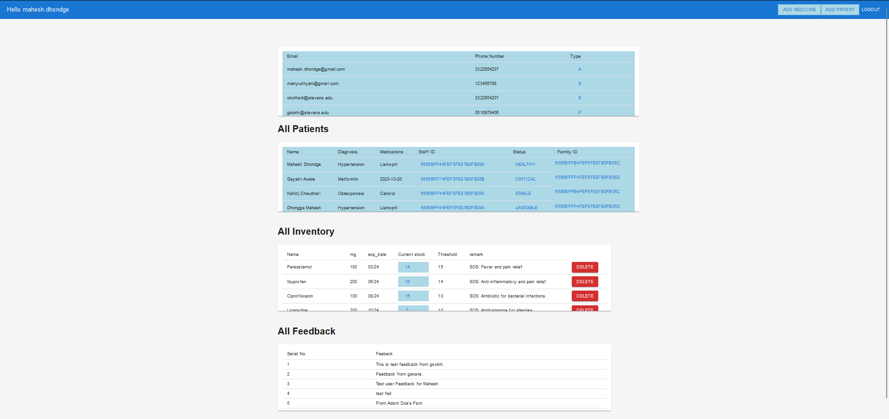
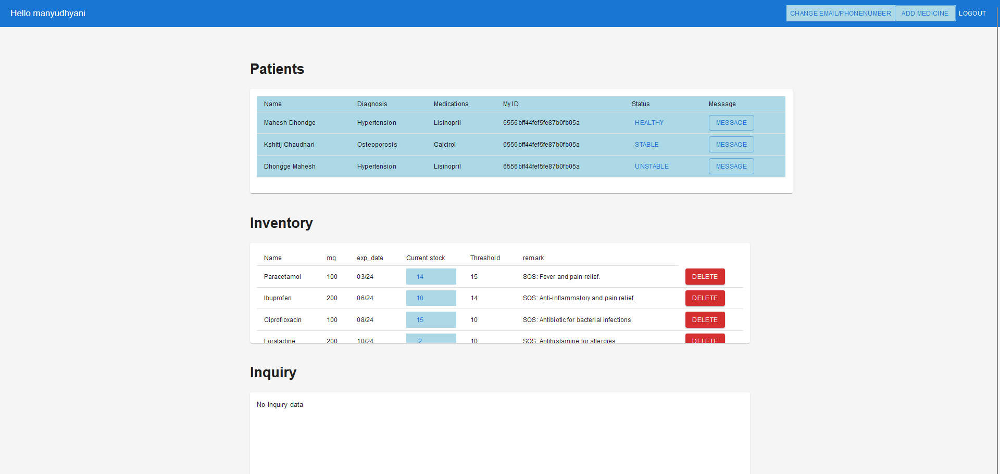
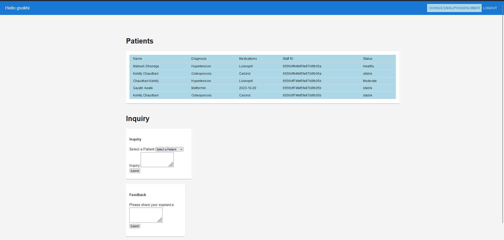
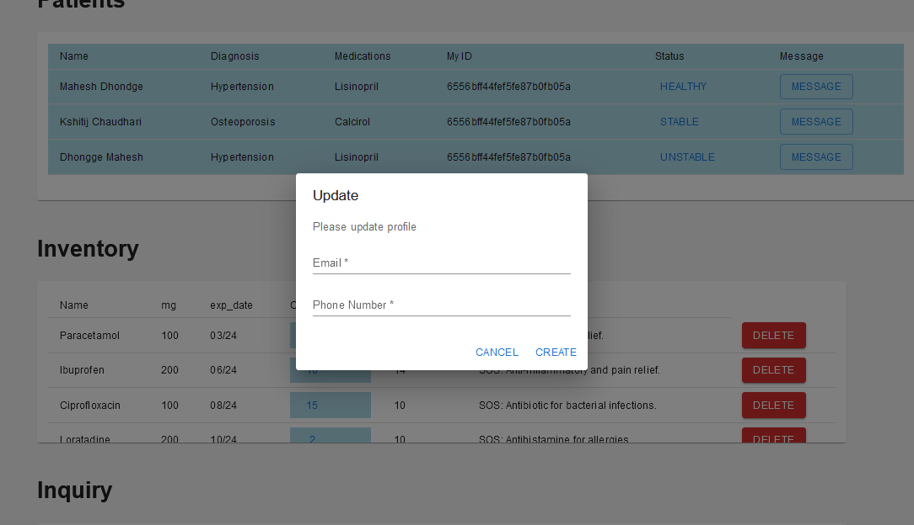
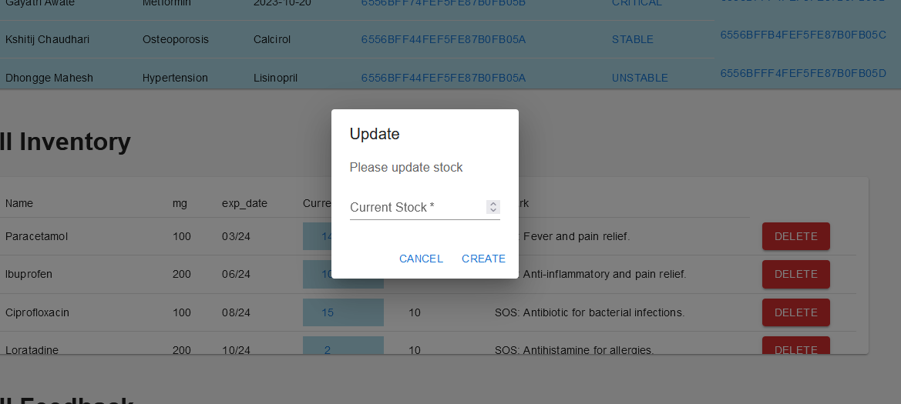
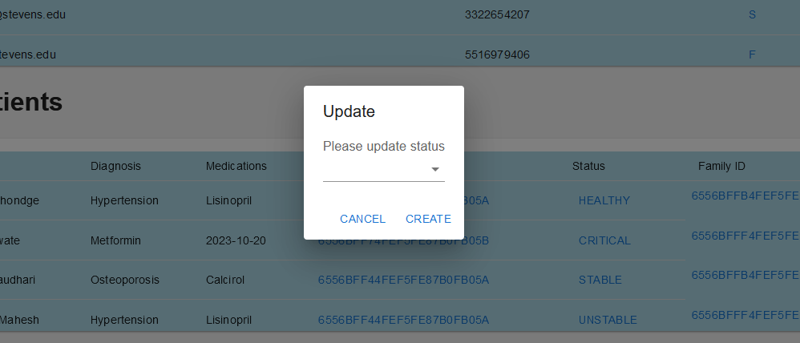
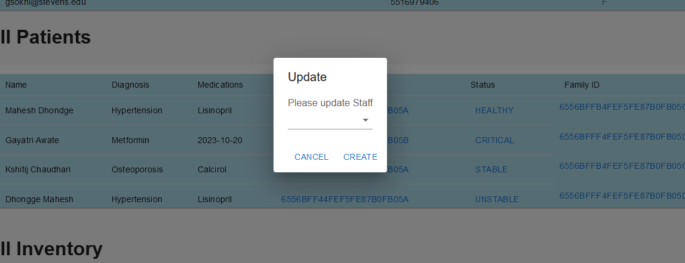
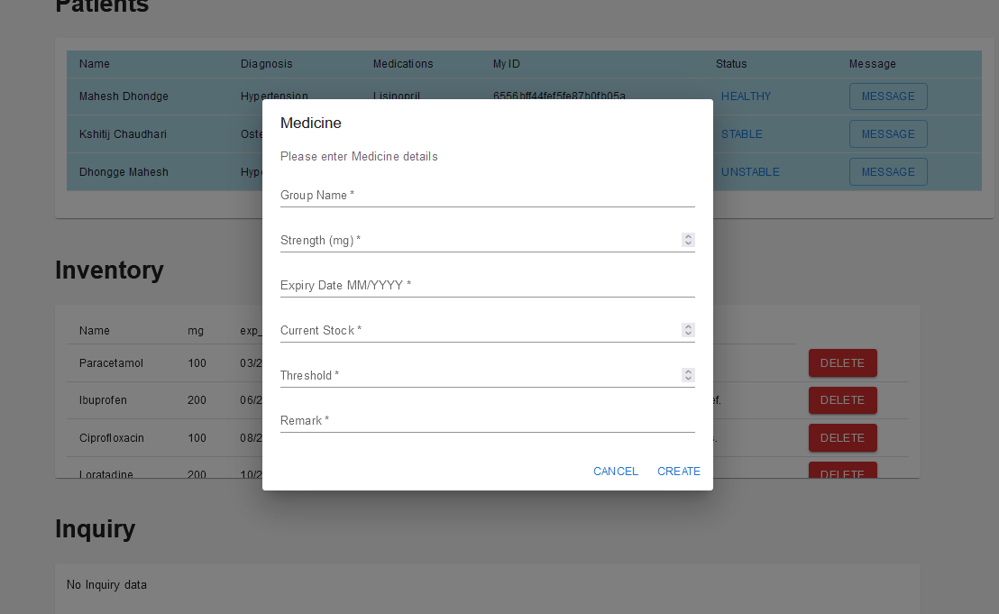
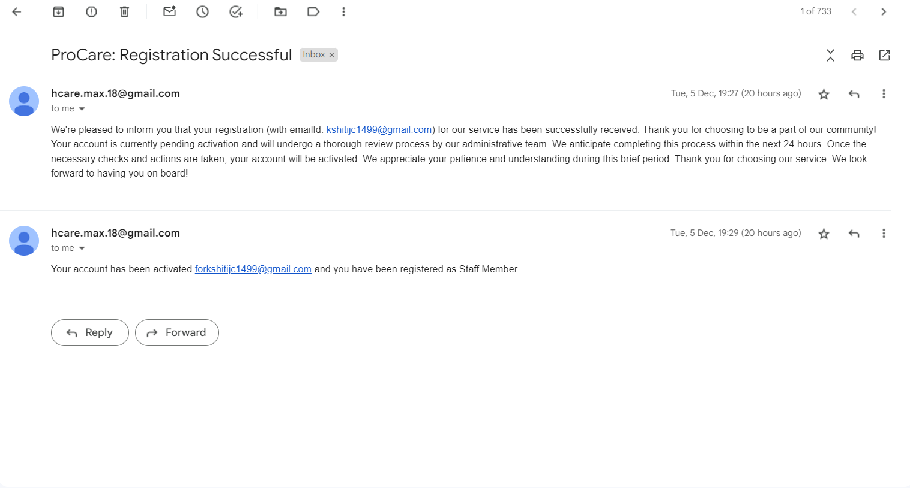
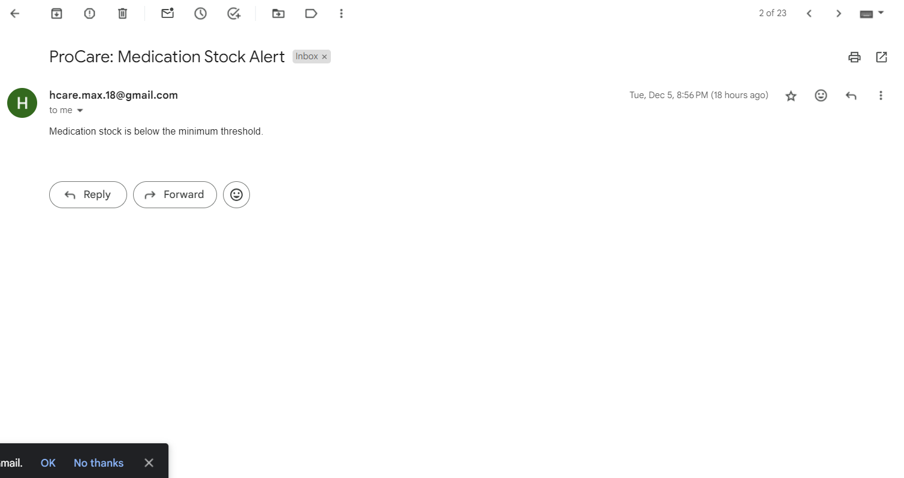

# Team18-AgileTech_Mavericks
This is official repo for CS 555  Agile Methods for Software Development.

## Welcome to guideline: how to run it locally!

There are 2 servers in the repo:
1) Express.js/Node.js-Server
2) React-Server

The project have to run in the above sequence, from 1 to 2.

### Step_1) Running the Express Server (BackEnd Server)
First open terminal and change directory to Backend using cmd:
>> cd .\Backend\ 

Install all dependencies in package.json using cmd:
>> npm install

Note: we added MongoDB cluster from cloud and have some dummy profile to test application mentioned below. To still locally please change Server Url in Backend>Config>Settings to localhost.
"serverUrl": "mongodb://localhost:27017/",

You can use that cloud cluster link to get access to Database from Mongo Compass.

Dummy Profile:
Admin: "mahesh.dhondge@gmail.com" password: "password1234"
Staff: "manyudhyani@gmail.com" password: "password1234", "ckothadi@stevens.edu" password: "password1234"
Family: "gsokhi@stevens.edu" password: "password1234", "skala1@stevens.edu" password: "password1234", "gawate@stevens.edu" password: "password1234"

Now continuing with backend server:
Note: Before Running the Express server please check for MongoDB on your system. The MongoDB should be running at port 27017.
Now run the Express server using cmd:
>> npm start

By default it will run at http://localhost:8000/

### Step_2) Running the React Server (FrontEnd Server)
Again open another terminal and change the directory to Frontend using cmd:
>> cd .\Frontend\

Install all dependencies in package.json using cmd:
>> npm install

Now run the React server using cmd:
>> npm start

By default it will run at http://localhost:3000/

Troubleshooting:

Main error can be related to library compatibility with node version. For that we want to mention our project is build on node version: v16.17.0

## Note: For now you have to assign 'F' and 'S' manually in MongoDB inside the field 'type' in the user collection, to test family and staff dashboards.

### Step_3) Running the Test Case File for Sprint 4

We create a file called "automationTest.js" in Test Folder of the root directory.

Change to that folder: 
>> cd .\Tests\  

To run the file: First install nodemailer module.
>> npm install nodemailer  

Then run automationTest.js
>> node automationTest.js  

## Database Schema for ProCare

## Product Demo Images
There are 3 separate dashboards for admin, staff and family member of the patient, depending on the user types.
### Admin Dashboard

### Staff Dashboard

### Family Dashboard

There are various pop ups from where we can update Patient details, health status, medicine inventory, and other related fields. This can be done by either admin or staff.
### Profile Update

### Medicine inventory Stock Update

### Health status Update

### Allocating certain staff to a patient.

### Adding new Inventory Stock or New Patient.

### Automated Email Notifications for stock alert, Successful Registration, Staff update, feedbacks, Patient health update, new staff Allocation, and 24 hours patient health.

