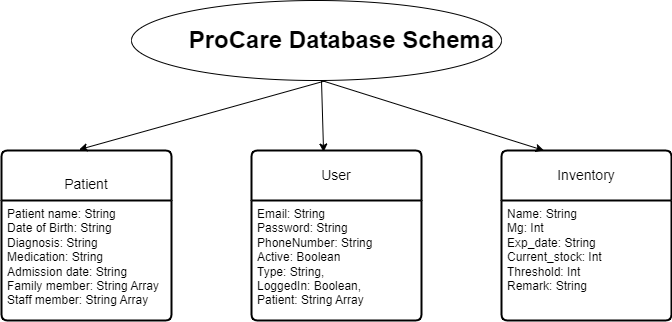

# Team18-AgileTech_Mavericks
This is official repo for CS 555  Agile Methods for Software Development.

## Welcome to guideline: how to run it locally!

There are 2 servers in the repo:
1) Express.js/Node.js-Server
2) React-Server

The project have to run in the above sequence, from 1 to 2.

### Step_1) Running the Express Server (BackEnd Server)
First open terminal and change directory to Backend using cmd:
>> cd .\Backend\ 

Install all dependencies in package.json using cmd:
>> npm install

Note: Before Running the Express server please check for MongoDB on your system. The MongoDB should be running at port 27017.
Now run the Express server using cmd:
>> npm start

By default it will run at http://localhost:8000/

### Step_2) Running the React Server (FrontEnd Server)
Again open another terminal and change the directory to Frontend using cmd:
>> cd .\Frontend\

Install all dependencies in package.json using cmd:
>> npm install

Now run the React server using cmd:
>> npm start

By default it will run at http://localhost:3000/

Troubleshooting:
Main error can be related to library compatibility with node version. For that we want to mention our project is build on node version: v16.17.0

## Database Schema for ProCare

